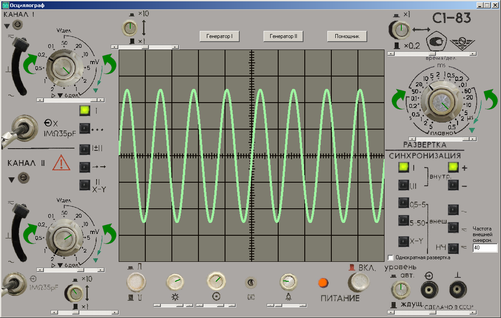
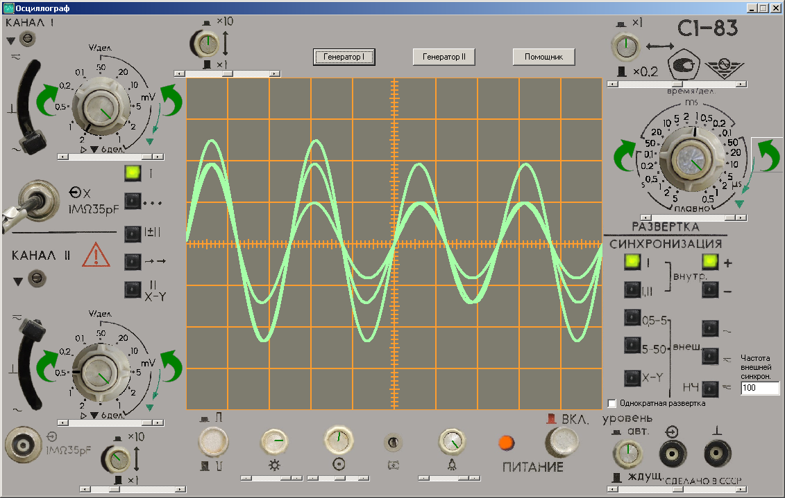
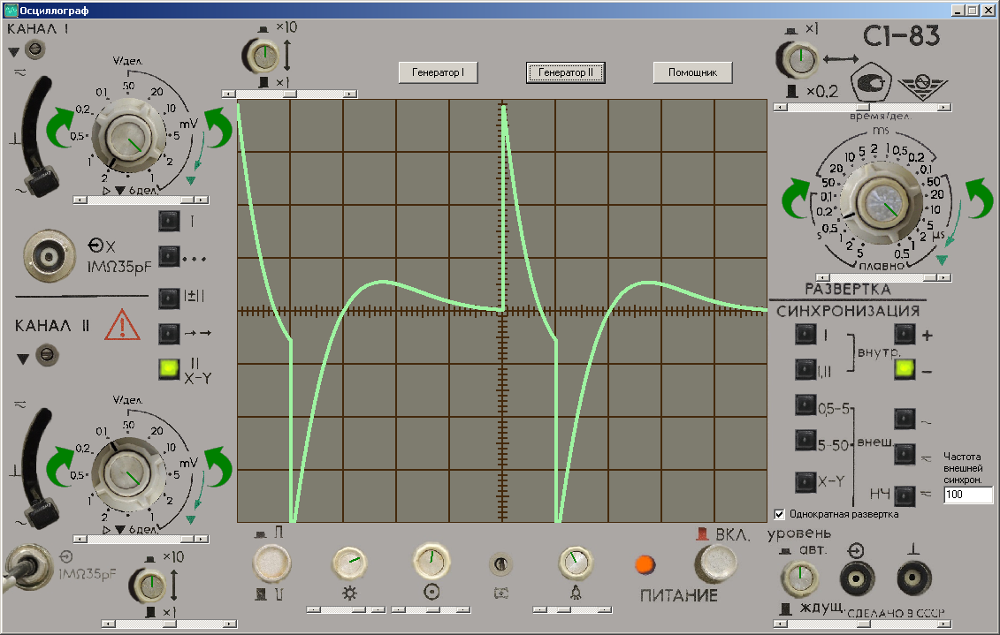
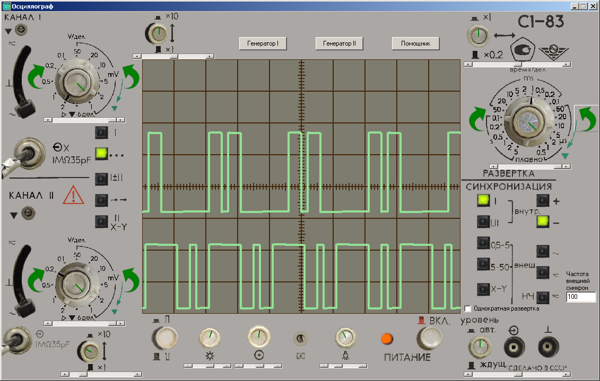
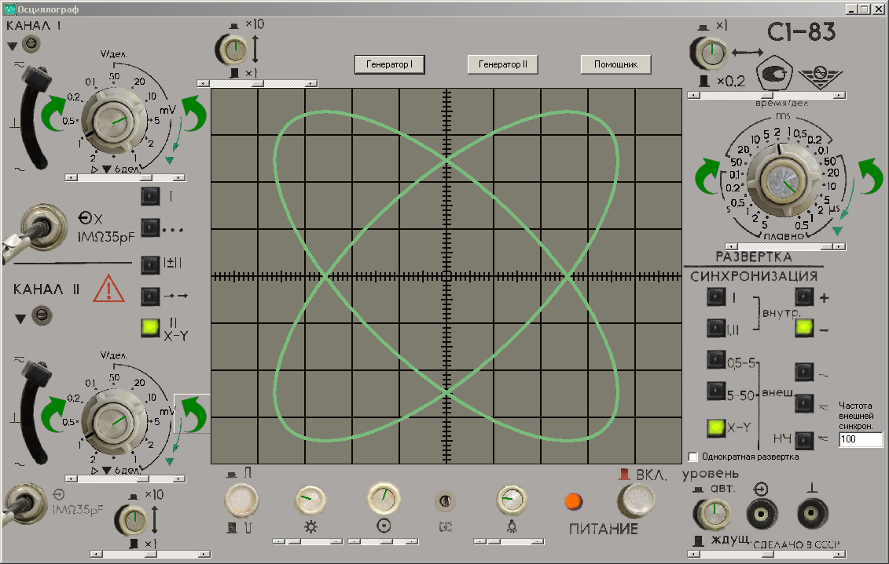
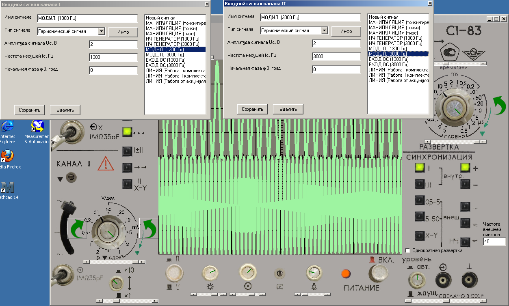
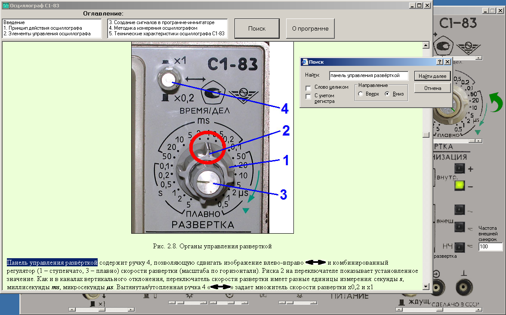
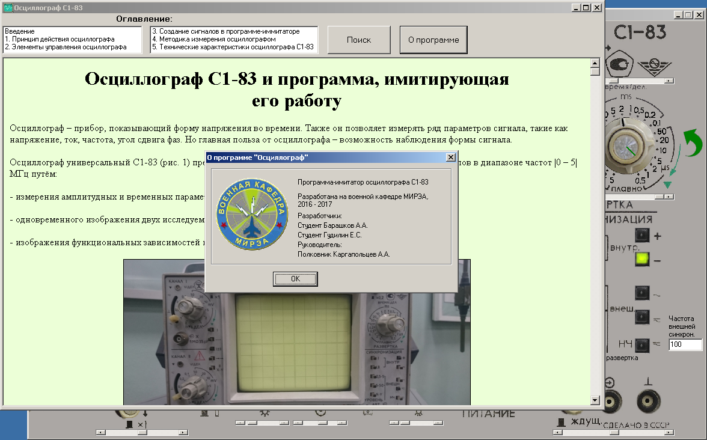

# Учебный имитатор аналогового осциллографа
Программа подойдёт для желающих изучить методику работы с осциллографом, для проведения лабораторных работ, ну и просто покрутить ручки и посмотреть, как меняется картинка.  
Имеется сборка для Windows (x86).  
Написана на **C++** в среде **Borland C++ Builder** с использованием компонентов **VCL**.  
Создана программа была мною с товарищем для **военной кафедры**, в качестве научной работы.  
## Возможности:  
- имитация гармонического, амплитудно-модулированного, частотно-модулированного, фазово-модулированного и импульсных сигналов с различными характеристиками;  
- краткое описание каждого из сигналов;  
- имитация различных режимов синхронизации развёртки;  
- имитация различных режимов отображения сигналов;  
- фигуры Лиссажу (режим X-Y);
- режим подачи сигнала через фильтр высоких частот;  
- имитация настройки подсветки экрана, фокусировки луча, яркости луча;  
- возможность сохранения сигналов со своими параметрами;  
- наличие описания элементов управления реального осциллографа и методики измерения сигналов с его помощью (на основе материалов с ресурса <http://www.electroclub.info/article/oscillograf.htm>);  
- автоматическое сохранение положений всех элементов управления и параметров сигналов при выходе из программы;  
- для работы программы не требуется никаких дополнительных библиотек, фреймворков; программа состоит из одного исполняемого файла.  

## Требования:  
- ОС **Windows**, начиная с 95. Возможна работа в **Wine**.  

  
  
  
  
  
  
  
  
Барашков А.А., Гудилин Е.С., 2016 - 2017
